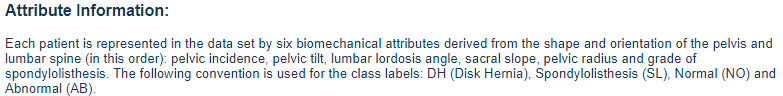

# MANE 4333

## Homework 6 - k-Nearest Neighbor Classification

### Assigned: October 31, 2024
### Due: November 11, 2024

Use the Vertebral Column Data Set from the UCI Machine Learning Repository. This data set contains 6 attributes that are used to determine the state of a person's spine. Each person's spine is labelled as DH, SL, NO or AB.

The column names for the data set (taken from the UCI Machine Learning Repository) are provided below.

#### Problem 1

Use the technique presented in Jupyter Example 2 to determine the optimal value of *k* using KNeighborsClassifier. Prepare a plot and add a print statement to the Problem 1 cell to state the optimal value of *k*. Make sure to set a seed value so the results do not change.

#### Problem 2

Implement a k-nearest neighbor classifier using the value of *k* founding in Problem 1. Print the training set and testing set accuracies.

#### Problem 3

Calculate a text-based confusion matrix for the model trained in Problem 2. Also generate a normalized and non-normalized graphical confusion matrix for the model from Problem 2.

#### Problem 4

Use a six-fold cross-validation of the *k*-nearest neighbor classifier using the value of *k* found in Problem 2. Print the accuracy for the six different folds and the overall average of the six-fold cross-validation model.

